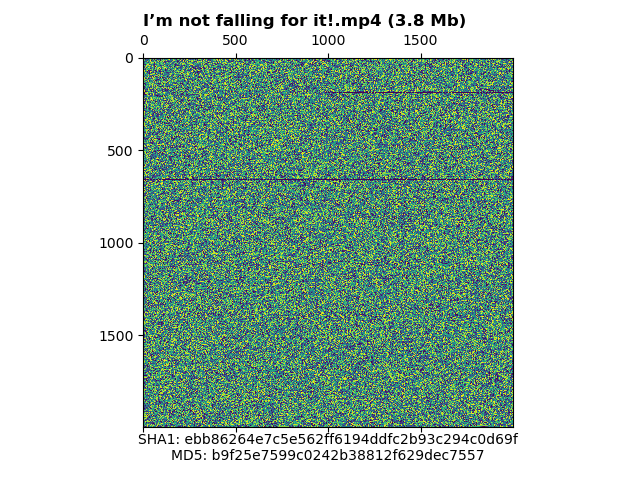

# Visualize Binary File as Image

This python script allows you to visualize any file as an image.


## Usage:

Simply run the python script and point it to a file of your choice.

```
python3 visualize-binary-file-as-image.py /path/to/your/file
```

Once finished, you will see a new PNG file with the basename of the input file in the folder of the python script.

## More Examples

### .csv data


### .mp4 video file



### .exe Windows executable file


### Encrypted files from Solarleaks website


